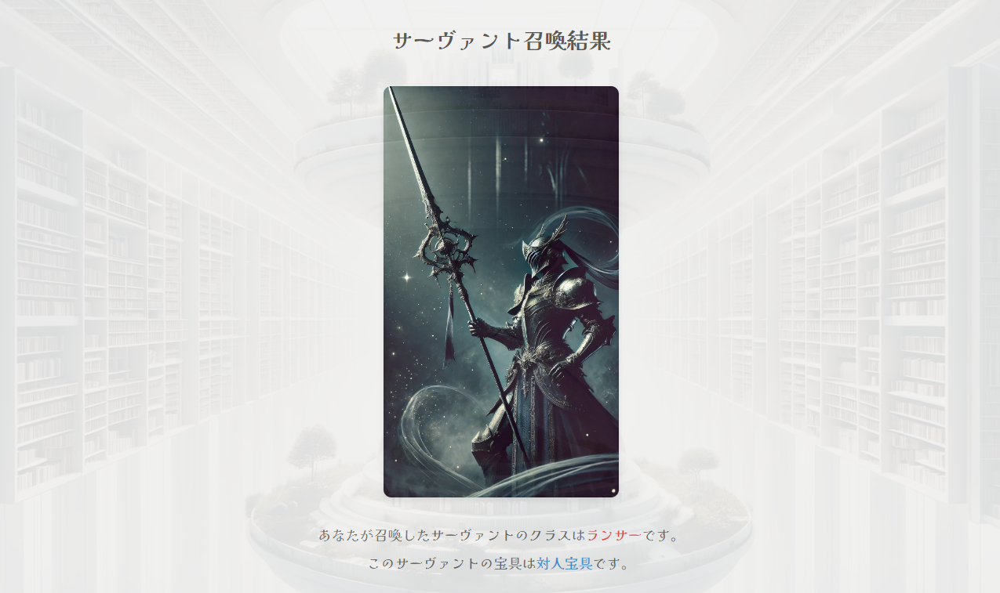

# vscode-fate-summoning 

## 機能

この拡張機能は、VS Code内でFateシリーズのサーヴァント召喚体験を提供します。主な機能は以下の通りです：

- マスター名の入力
- ランダムなサーヴァントクラスの選択
- ランダムな宝具タイプの選択
- 召喚結果の視覚的な表示（サーヴァントクラスの画像付き）

以下は拡張機能の動作例です：

## 要件

この拡張機能には特別な要件やシステム依存性はありません。VS Codeがインストールされていれば使用可能です。

## 拡張機能の設定

現在、この拡張機能には特別な設定項目はありません。将来的に設定オプションを追加する可能性があります。

## 既知の問題

現時点で報告されている既知の問題はありません。問題を発見した場合は、GitHubのIssueトラッカーで報告してください。

## リリースノート

### 1.0.0

初回リリース

- サーヴァント召喚機能の実装
- 7つのメインクラスのサポート
- 5種類の宝具タイプの実装

